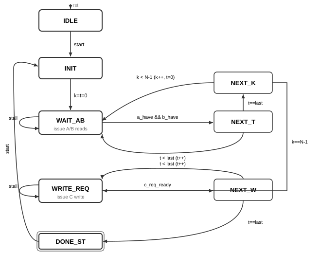

# DE1-SoC GPU

A SIMT GPU written in SystemVerilog, targeting the Terasic DE1-SoC (Cyclone V). Executes parameterised N×N integer matrix multiplication across multiple hardware threads using a shared-memory arbitration model.

Built from scratch as an educational project — no vendor GPU IP, all RTL hand-written and verified in ModelSim ASE.

**Configuration:** `NUM_CORES = 4`, `THREADS_PER_CORE = 2`

---

## Table of Contents

- [Overview](#overview)
- [Architecture](#architecture)
- [Modules](#modules)
- [Scheduler FSM](#scheduler-fsm)
- [Memory Model](#memory-model)
- [Running Simulations](#running-simulations)
- [Roadmap](#roadmap)

---

## Overview

Each core runs a two-thread kernel that computes a block of output elements of matrix C. The dispatcher hands out work blocks to free cores and raises `done` when all blocks are complete — visible on the board's HEX displays as **DONE**.

**v1 (archived):** 2 cores, one dedicated BRAM port per core. Does not scale past `NUM_CORES = 2`.

**v2 (current):** 4 cores share one physical read port per matrix (A, B) and one write port (C), each arbitrated by a round-robin arbiter. Cores stall on contention — the contention is instrumented, not hidden.

---

## Architecture


`de1soc_top.sv` is the synthesis top. It instantiates `gpu_top` and the two Quartus memory IPs (`matrix_ab`, `matrix_c`) outside the GPU boundary. `gpu_top` contains the dispatcher, four cores, and three arbiters.

---

## Modules

| Module | Description |
|---|---|
| `dispatcher.sv` | 3-state FSM (IDLE → RUN → FINISH). Distributes work blocks to free cores via valid/ready handshake. |
| `core.sv` | Wraps one scheduler, two threads, A/B response latches, and address MUXes. |
| `scheduler.sv` | 8-state kernel FSM. Issues memory requests and stalls until granted. |
| `thread.sv` | Address generation and FMA accumulation for one C element. |
| `fma.sv` | 1-cycle pipelined fused multiply-accumulate: `result = (a*b) + c`. |
| `rr_read_arbiter.sv` | Round-robin read arbiter. `resp_valid` fires `BRAM_LATENCY` cycles after grant. |
| `rr_write_arbiter.sv` | Round-robin write arbiter. No response path — write commits on grant. |
| `dual_port_bram.sv` | Simulation BRAM model. 1-cycle read latency. |

---

## Scheduler FSM

Each core's scheduler drives the inner-product loop, stalling on memory contention:



| State | Action |
|---|---|
| `IDLE` | Wait for `start`. Reset counters. |
| `INIT` | Assert `kernel_init` to zero thread accumulators. |
| `WAIT_AB` | Issue A/B read requests. Stall until both `a_have` and `b_have`. Pulse `fma_en[t]`. |
| `NEXT_T` | Advance thread index. Loop back to `WAIT_AB` or advance to `NEXT_K`. |
| `NEXT_K` | Advance k. Loop back to `WAIT_AB` (k < N-1) or proceed to write phase (k = N-1). |
| `WRITE_REQ` | Issue C write request. Stall until `c_req_ready`. |
| `NEXT_W` | Advance write-phase thread index. Loop or finish. |
| `DONE_ST` | Hold until `rst` or next `start`. |

---

## Memory Model

All four cores share one physical port per matrix, arbitrated by round-robin:

```
core 0..3  ──▶  A Read Arbiter  ──▶  matrix_ab (port A)
core 0..3  ──▶  B Read Arbiter  ──▶  matrix_ab (port B)
core 0..3  ──▶  C Write Arbiter ──▶  matrix_c
```

**BRAM latency:** `rr_read_arbiter` takes a `BRAM_LATENCY` parameter — how many cycles after a grant `resp_valid` fires. Default `1` matches `dual_port_bram` in simulation. `de1soc_top` passes `BRAM_READ_LATENCY=2` to match the real `matrix_ab` altsyncram IP (registered address + registered output = 2 cycles).

---

## Running Simulations

Each module has a `run.do` script. Run from a ModelSim Tcl console:

```tcl
do "C:/Users/User/Desktop/Year 3/DE1-SoC-GPU/tb/scheduler/run.do"
do "C:/Users/User/Desktop/Year 3/DE1-SoC-GPU/tb/core/run.do"
do "C:/Users/User/Desktop/Year 3/DE1-SoC-GPU/tb/fma/run.do"
do "C:/Users/User/Desktop/Year 3/DE1-SoC-GPU/tb/arbiter/run_read.do"
do "C:/Users/User/Desktop/Year 3/DE1-SoC-GPU/tb/arbiter/run_write.do"
```

Full system test:

```tcl
do "C:/Users/User/Desktop/Year 3/DE1-SoC-GPU/tb/Top/run.do"
```

All scripts compile from `rtl/` directly — run them from any directory.

---

## Roadmap

### Done

- [x] Round-robin read/write arbiters with parameterised `BRAM_LATENCY`
- [x] 4-core shared-memory architecture (v2)
- [x] Dispatcher valid/ready handshake
- [x] Contention instrumentation (`stall_cycles`, `grant_count`)
- [x] Unit testbenches for all modules
- [x] DE1-SoC synthesis project (Quartus)
- [x] HEX display shows **DONE** on completion

### Next Steps

- [ ] Define a minimal ISA (load/store/FMA/branch)
- [ ] Build a scalar programmable core (replace fixed-function thread/scheduler)
- [ ] Extend to true SIMT (shared PC, per-thread register file, active mask)
- [ ] Re-attach SIMT datapath to existing arbiters
- [ ] Hand-assemble and run a matmul kernel on the programmable core
- [ ] Add SVA assertions to arbiters and dispatcher
- [ ] UVM environment for the SIMT core
